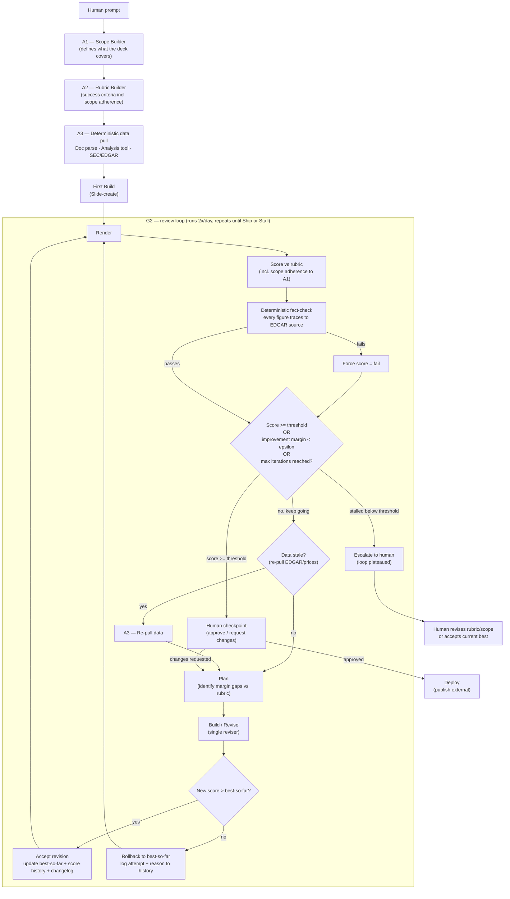

# Equity-research deck generator — tightened state machine

Cleaned-up version of the original two-graph sketch (G1 cold start + G2 review
loop). Collapses the duplicate critics into a single grader/reviser, adds an
explicit stop rule, regression rollback, in-loop fact-checking, a data-refresh
decision, and a human gate + stall escape.

## What changed vs. the original sketch, and why

1. **Explicit stop rule** — `Decide` node: ship when score ≥ threshold, OR
   stop iterating when improvement margin < epsilon, OR max iterations hit.
   "Loop 2x daily" is now just the *cadence* at which the state machine is
   invoked, not the termination condition itself.

2. **Regression protection** — `Compare` + `Rollback`. A revision is only
   kept if it scores higher than the current best-so-far. Score history and a
   changelog record every attempt (accepted or rolled back), so drift is
   visible and reversible.

3. **In-loop fact-check** — `FactCheck` sits between `Score` and `Decide` on
   every pass, not just at cold start. Any number that doesn't trace back to
   its EDGAR/analysis source forces a failing score, so the LLM judge is never
   the sole gate on factual accuracy.

4. **Linear, executable loop ordering** — replaced
   `Review → Plan → Deploy → Revise → Build → Score` with
   `Render → Score → Fact-check → Decide → Plan → Build → Render`.
   `Deploy` now means "publish externally" and only happens after the human
   gate — intermediate iterations never go out the door.

5. **One grader, one reviser** — G1 produces only the scaffold (scope,
   rubric, data pull, first draft). All review/scoring/revision lives in the
   single G2 loop, removing the duplicate critic implementations.

6. **Memory** — `score history` and `changelog` are first-class artifacts
   updated on every `Accept`/`Rollback`, enabling regression detection and
   "what changed and why" auditing across the twice-daily runs.

7. **Data freshness inside the loop** — `Refresh` decision re-pulls
   EDGAR/analysis data when stale before planning revisions, so prose isn't
   polished against numbers that have since moved.

8. **Human gate + stall escape** — `HumanGate` before `Deploy` (approve or
   send back to `Plan`), and a separate `Stall` path when the score plateaus
   below threshold without hitting it, escalating to a human rather than
   spinning forever.

Rubric (A2) should include **adherence to original scope (A1)** as one of its
scored dimensions, so iterative revision can't drift the deck off-brief.
