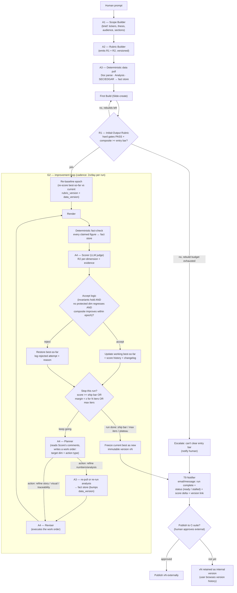

# Equity-research deck generator — agentic build plan

A defined plan for an autonomous deck generator that produces an
equity-research / investor deck from a prompt, then improves it on a
twice-daily loop without drifting from **truth**, **story**, or **visual
clarity**.

This document covers: (0) the **orchestrator** that drives everything,
(1) the state machine, (2) how the two rubrics are **built and calibrated**,
(3) the **Initial-Output Rubric (R1)**, (4) the **Loop Improvement Rubric
(R2)**, (5) the accept/reject math (and why monotonic improvement holds only
within a data/rubric epoch), (6) the skill/agent catalog (deterministic tools
vs. LLM agents), (7) the persisted state + immutable version history,
(8) open decisions, and (9) known weaknesses we are accepting or watching.

---

## 0. Orchestration model (the manager agent)

Everything below is coordinated by a single **orchestrator** — a manager, not
a worker. The defining rule:

> **The orchestrator decides *what* needs to happen and *which* agent does it.
> It never does the work itself.** No code, no HTML, no number-crunching, no
> slide-writing, no reviewing.

What that means concretely:

- **It delegates, it doesn't perform.** Need data? It dispatches the EDGAR
  tools. Need a draft? It dispatches the Drafter. Need the deck rendered? It
  dispatches the Renderer. The orchestrator itself writes nothing into the
  deck or the fact store.
- **It does not review — it commissions reviews.** The orchestrator never
  forms its own opinion of the deck's quality. It sends the **Reviewer (L4)**
  to produce the ranked weakest-parts list, then sends a **Reviser (L6)** to
  fix exactly what the reviewer found. Its job is routing the hand-off, not
  judging the deck.
- **It owns control flow, not content.** The orchestrator reads compact
  *signals* — "review returned 4 weak parts," "fact-check failed on 2
  figures," "composite went 3.83 → 3.98, accepted" — and from those decides
  the next move: dispatch the Planner, accept/reject via the score aggregator,
  loop again, escalate, or route to the human gate. Every arrow in the §1
  state machine is an orchestrator decision.

### 0a. Context discipline (why the manager stays lean)

The orchestrator is **optimized for the smallest, highest-signal context
possible**, because its only job is high-quality routing decisions — and a
manager buried in raw material makes worse decisions.

- **Heavy artifacts live outside its context.** The full deck, raw filings,
  parsed tables, and long tool outputs are passed between workers **by
  reference** (IDs / file handles / fact_ids), not pasted into the
  orchestrator. Workers read and write the heavy state; the orchestrator only
  holds pointers to it.
- **Workers return summaries, not dumps.** Each agent reports back a compact
  result — counts, scores, pass/fail, a short reason, an artifact handle — not
  its full working output. The Reviewer hands back a ranked list and a handle,
  not the deck re-pasted; the EDGAR tool hands back "12 facts updated" + the
  fact_ids, not the filings.
- **State lives in the persisted files (§7), not the prompt.** best-so-far,
  score history, and the changelog are on disk. The orchestrator queries what
  it needs for the current decision and nothing more, so its context doesn't
  grow with iteration count over a long-lived, twice-daily asset.

The payoff: the orchestrator can run many iterations without its context
bloating, stays fast and accurate at the one thing it does — deciding who
works next — and the expensive, context-heavy work is isolated in the workers
where it belongs.

---

## 1. State machine



Two rubrics do two different jobs:

- **R1 (Initial-Output Rubric)** is an *acceptance gate*. It answers: "is the
  first draft good enough to be worth iterating on?" It runs **once**, between
  the first build and loop entry. Absolute thresholds, no history.
- **R2 (Loop Improvement Rubric)** is a *delta/monotonicity rubric*. It answers
  every iteration: "is this revision strictly better, and did it break any
  invariant?" It compares against best-so-far, not an absolute bar.

**The loop as a review cycle.** The Score → Plan → Build sequence is an
automation of how a research desk actually revises a deck:

- **Score** is the **senior reviewer's markup** — a structured set of comments
  against the rubric ("the thesis slide doesn't land," "this chart buries the
  number," "the margin bridge is stale").
- **Plan** is **triaging those comments into a work order.** It doesn't just
  pick *which dimension* to improve next — it decides *what kind of work* is
  needed to address the comment: refresh a number / re-run an analysis,
  restructure the narrative, redesign a visual, or improve source labeling.
  This is the step that decides whether new data needs to be pulled — driven
  by what the deck needs, not by a fixed schedule.
- **Build (Reviser)** is the **analyst doing the rework** — executing exactly
  the work order Plan wrote, nothing more. If the work order calls for new or
  re-run data, Build first invokes A3's deterministic tools (re-pull EDGAR,
  re-run the analysis model) to get fresh facts into the fact store, then
  edits the deck against those facts.

So "data refresh" isn't a separate scheduled step — it's one of the actions
Plan can prescribe, exactly like a senior reviewer telling an analyst "pull
the latest 10-Q before you touch this slide again."

---

## 2. How the rubrics are built (Rubric Builder, A2)

A rubric is only useful if its dimensions are **observable, anchored, and
calibrated**. The Rubric Builder produces both rubrics through the same
five-step method, then versions them so changes are auditable.

1. **Derive dimensions** from two sources:
   - the **brief (A1)** — audience, thesis, required sections → scope/coverage
     dimensions;
   - **domain invariants** — for finance, every number is sourced; no
     forward-looking claim without a basis. These become *hard gates*, not
     graded dimensions.
2. **Anchor each dimension** with concrete descriptors at each scale point
   (see R1/R2 tables). "Actionability = 5" must read as an observable test a
   judge can apply the same way twice, e.g. *"every section ends with a
   decision-relevant takeaway tied to the thesis."* Vague anchors are the #1
   cause of judge noise.
3. **Assign weights** reflecting the brief's priorities. Weights live in the
   rubric file, not in the judge prompt, so they can be tuned without touching
   agent code.
4. **Calibrate against gold examples.** Hand-score 3–5 reference decks
   (a strong one, a weak one, and 2–3 in between). Run the LLM judge on them
   and adjust anchors until judge scores land within ±1 point of human scores.
   This is the step that turns "LLM-as-judge" from a guess into a measurement.
5. **Validate & version.** Hold out one gold deck; require judge↔human
   agreement on it before the rubric is allowed to drive the loop. Stamp the
   rubric with a semantic version; the changelog (§7) records every rubric
   change so a score jump can be attributed to a rubric edit vs. a real deck
   improvement.

> Calibration is not optional. Without it, R2's "improvement" is just judge
> variance and the loop will happily climb noise.

---

## 3. R1 — Initial-Output Rubric (acceptance gate)

Purpose: keep junk first-drafts out of the loop. Two parts.

**3a. Hard gates (binary — all must PASS to enter the loop):**

| Gate | Pass condition |
|---|---|
| Source-of-truth | 100% of figures/claims in the draft resolve to a fact-store entry with a citation. Zero unsourced numbers. |
| Scope coverage | Every required section from the brief (A1) is present and non-empty. |
| Structural validity | Deck renders; no broken slides, no placeholder text, no TODOs. |

Any gate fail → not "low score," but **reject and rebuild**. The loop never
starts on a draft with an unsourced number.

**3b. Graded baseline (0–5 anchored; weighted composite must clear the entry bar):**

| Dimension | Weight | 0 | 3 | 5 |
|---|---|---|---|---|
| Thesis clarity | 0.30 | no discernible thesis | thesis stated, loosely supported | thesis stated up front, every section ladders to it |
| Coverage depth | 0.25 | headings only | key drivers present | drivers + risks + catalysts quantified |
| Narrative flow | 0.20 | slides unordered | logical order | story builds; each slide earns the next |
| Visual baseline | 0.15 | walls of text | readable | one idea per slide, charts where numbers belong |
| Actionability | 0.10 | descriptive only | some takeaways | clear, decision-relevant recommendation |

Entry bar: **composite ≥ 3.2 / 5** AND all hard gates PASS. Below that, the
first build is cheaper to redo than to iterate.

---

## 4. R2 — Loop Improvement Rubric (monotonic, per-iteration)

This is the rubric the user asked for: it guarantees we **increase** on the
things that matter while **never derivating from truth, the story, or the
visuals.** It splits dimensions into *protected invariants* and *improvement
targets.*

**4a. Protected invariants (must hold every iteration; regression = auto-reject):**

| Invariant | Measured by | Rule |
|---|---|---|
| **Truth / source-of-truth** | deterministic fact-check (not the LLM judge) | Every figure traces to the fact store with a matching value. Any mismatch → reject revision, roll back. Score floored to 0 on this dim. |
| **Scope adherence** | judge vs. brief (A1) | Required sections still present and on-brief. Drop in coverage below R1 level → reject. |
| **Story integrity** | judge, narrative-coherence check | The through-line from R1 must not break. A revision that improves one slide but severs the thesis chain is rejected. |
| **Visual integrity** | judge + render lint | No new walls of text, no overflow, no chart removed that carried a number. Visual score may not drop below its accepted best. |

These are *floors*, not climb targets. They can stay flat; they may never go
down. This is what enforces "do not derive from truth, story, or visuals."

**4b. Improvement targets (0–5 anchored; the loop hill-climbs the weighted composite):**

| Dimension | Weight | What "5" looks like (anchor) |
|---|---|---|
| **Actionability** | 0.25 | Every section ends in a decision-relevant takeaway tied to the thesis; reader knows what to *do*, not just what *is*. |
| **Executive altitude (C-suite fit)** | 0.20 | Exec-summary / "so what" up front; right level of abstraction for a CEO/CFO/board; anticipates the obvious executive questions and answers them; no analyst-level detail that an exec wouldn't ask for. |
| **Visual digestibility** | 0.20 | Each slide graspable in <10s: one idea, the right chart type, hierarchy guides the eye, minimal text. |
| **Clean & concise story** | 0.20 | Tight through-line, no redundant slides, each builds on the last; could be read aloud as a coherent argument. |
| **Metric traceability quality** | 0.15 | Beyond merely *passing* the truth gate: every metric is *labeled* with its source, period, and units inline, so the reader can self-verify. |

> Note the split on numbers: the **truth invariant (4a)** is a binary
> deterministic gate — "does this number exist in the fact store?" The
> **traceability dimension (4b)** is a graded quality target — "is the number
> *presented* so a reader can trace it?" The first prevents fabrication; the
> second is a thing we actively get better at.

**Composite:** `R2 = 0.25·Action + 0.20·Exec + 0.20·Visual + 0.20·Story + 0.15·Trace`,
on the [0,5] scale, computed **only when all 4a invariants hold.**

---

## 5. Accept / reject math (the monotonicity guarantee)

Let `b` = best-so-far snapshot, `c` = candidate revision. Per-dimension scores
from R2's improvement targets are `s_d`; invariant flags from 4a are booleans.

**Accept `c` iff ALL of:**

1. **Invariants hold:** every 4a check on `c` PASSes (truth, scope, story,
   visual integrity). One fail → reject.
2. **No protected regression:** for each invariant dimension that carries a
   score (story, visual), `s_d(c) ≥ s_d(b) − τ`, with tolerance `τ = 0`
   for truth/scope and a small `τ = 0.1` for story/visual to allow lossless
   restructuring.
3. **Strict improvement:** `R2(c) ≥ R2(b) + δ` where `δ` is the minimum
   meaningful margin (e.g. `δ = 0.15`), so we don't accept judge noise.

Otherwise **roll back to `b`** and log the rejected attempt + reason. This is
hill-climbing with rollback: the composite is monotonically non-decreasing
across accepted iterations, and the invariants are monotonically protected.

**Monotonicity holds only within an epoch — and that's deliberate.** An
"epoch" is a fixed `(rubric_version, data_version)` pair. The guarantee above
is *relative to the facts and rubric in force.* When new data lands (a fresh
10-Q moves a margin, a price updates), reality itself can lower a score — and
the deck **must** follow reality down; that is correct behavior, not a
regression. So whenever `data_version` (or `rubric_version`) changes, the loop
**re-baselines**: it re-scores best-so-far against the new facts and resets the
reference point `b` to that re-scored value. Improvement is then measured
forward within the new epoch.

This resolves the otherwise-contradictory pair of goals — "never sacrifice
truth" and "monotonically improve." Truth wins: a reality-driven score drop
re-baselines rather than rolls back. Quality regressions *within* an epoch
(same facts, deck got worse) still roll back. `score_history` stamps both
`rubric_version` and `data_version` on every row, so a drop caused by reality
is always distinguishable from a drop caused by a bad revision.

**Stop conditions (any one):**

- **Ship:** `R2(b) ≥ ship_bar` (e.g. 4.3) AND all invariants PASS → human gate.
- **Plateau:** no accepted revision for `N` consecutive iterations
  (margin < δ) → escalate as stalled.
- **Budget:** `max_iters` reached → ship best-so-far to human gate.

Because every accepted step strictly increases the composite while holding the
floors, "the loop improves actionability / visual / story / traceability and
never sacrifices truth or coherence" is now a property the math enforces, not
a hope.

---

## 6. Skill / agent catalog

The system is a small set of **single-responsibility skills, each its own
agent.** They fall into two classes, and the split is deliberate:

- **Deterministic tools** are plain code (e.g. Python). Same input → same
  output, no LLM in the path. These own anything that must be **reproducible
  and trustworthy** — pulling numbers, computing analysis, verifying figures,
  rendering, and the scoring arithmetic. They are the **source of truth.**
- **LLM agents** are where **judgment** is required — writing prose, deciding
  what's weak, refining a story. They never produce a raw number that wasn't
  handed to them by a deterministic tool, and they never get the final say on
  factual accuracy.

Each skill is invoked as a separate agent with explicit inputs/outputs so it
can be built, tested, swapped, and reasoned about in isolation. Above both
classes sits the **orchestrator (§0)** — it belongs to neither, because it
runs no tool and writes no content; it only dispatches the skills below and
acts on their compact results.

| Manager | Responsibility | Holds in context |
|---|---|---|
| **O0 Orchestrator** | Decide what's next and which skill does it; route hand-offs (e.g. Reviewer → Planner → Reviser); never performs the work | plan + control state + artifact handles only — never raw decks/filings (§0a) |

### 6a. Deterministic tools (code — the source of truth)

| Skill | Responsibility | Input → Output |
|---|---|---|
| **T1 EDGAR/SEC fetcher** | Pull filings (10-K, 10-Q, 8-K) by ticker/CIK; cache raw | ticker/CIK, form types → raw filing docs |
| **T2 Document parser** | Extract tables & text from filings and uploaded docs | raw docs → structured rows/figures |
| **T3 Analysis engine** | Compute ratios, growth, margins, bridges from parsed figures | parsed figures → derived metrics |
| **T4 Fact-store writer** | Normalize every figure into a traceable record | metrics → `fact_store{id, metric, value, unit, period, source_url, retrieved_at}` |
| **T5 Fact-check / number-tracer** | Confirm every `fact_id`-tagged figure in the deck equals its fact-store value | deck + fact_store → pass/fail per figure |
| **T6 Renderer** | Turn the deck spec into rendered slides | deck spec → rendered deck |
| **T7 Render lint** | Detect overflow, walls of text, broken/empty slides | rendered deck → visual-integrity flags |
| **T8 Score aggregator** | Apply rubric weights, compute composite, run the accept/reject math (§5) | per-dim scores + invariant flags → composite + accept/reject decision |
| **T9 Notifier** | On run completion (or cold-start escalation), send email/message with status, score delta, and a link to the new version | run summary → email/Slack/message sent |
| **T10 Version writer** | Freeze the run's final deck as a new immutable version file; update the version index | best deck + run metadata → `versions/vN/…` + index row |
| **T11 Judge-consistency check** | Periodically re-score an *unchanged* best-so-far to detect judge drift; if self-variance > δ, flag it | best-so-far (unchanged) → judge-drift flag |

> Why deterministic: numbers, verification, the accept/reject decision,
> versioning, and notifications must be **reproducible and auditable.** If an
> LLM did the arithmetic or the figure-matching, "the loop never sacrifices
> truth" couldn't be guaranteed. T11 watches the one place we *can't* make
> deterministic — the LLM judge — by checking it scores identical input
> consistently.

### 6b. LLM agents (judgment)

| Skill | Responsibility | Input → Output |
|---|---|---|
| **L1 Scope Builder (A1)** | Interpret the prompt into a frozen brief | prompt → `brief{tickers, thesis, audience, required_sections[], tone}` |
| **L2 Rubric Builder (A2)** | Author + calibrate R1/R2 (§2) | brief → versioned `R1`, `R2` (weights + anchors) |
| **L3 Drafter / Slide-create** | Write the deck from the brief and fact store; tag every figure with its `fact_id` | brief + fact_store → `deck{slides[]}` |
| **L4 Reviewer / Scorer** | **Review the deck and produce a ranked list of its weakest parts** — per-dimension scores against R2, plus specific comments pointing at the slide/element and why it's weak | deck + R2 + fact_store → `review{per_dim_scores, weakest_parts[ranked], comments}` |
| **L5 Planner** | Triage the reviewer's weakest-parts list into one focused **work order** | review → `work_order{target_dim, action_type, instructions}`, `action_type ∈ {refresh_data, refine_analysis, refine_story, refine_visual, refine_traceability}` |
| **L6 Reviser** | **Execute the work order** — fix/refine exactly the parts called out, nothing more | deck + work_order + fact_store → revised deck (figures still `fact_id`-tagged) |

### 6c. The two rules that hold it together

1. **Reviewer ≠ Reviser.** The agent that *finds* the weakest parts (L4) is a
   different agent from the one that *fixes* them (L6). A critic grading its own
   rework drifts toward self-justification; separating them keeps the diagnosis
   honest and gives the loop a clean diff between "what was flagged" and "what
   was changed." L4 only describes problems; L6 only fixes the assigned one.

2. **LLMs never own a number.** Every figure originates in a deterministic tool
   (T1–T4), is verified by another (T5), and is only ever *arranged* by an LLM.
   When the Planner asks for fresh data, the Reviser calls the same T1–T4 tools
   the cold start used — it does not invent values to fill the gap.

---

## 7. Persisted state (loop memory + version history)

**Outputs are immutable and versioned — never overwritten.** Every completed
run freezes its final deck as a *new* file under `versions/vN/`. `best_so_far`
is just a working pointer used *inside* a run; the durable record is the
growing stack of versions the user can browse to watch progress over time.

```
versions/
  v001/  deck.json  render.pdf  scores.json  changelog.jsonl   ← run 1 output
  v002/  deck.json  render.pdf  scores.json  changelog.jsonl   ← run 2 output
  v003/  ...                                                    ← newest
  index.jsonl                                                   ← one row per version
```

```jsonc
// versions/index.jsonl — one immutable row per completed run
{ "version": "v003", "ts": "2026-06-14T12:00Z", "status": "ready_for_review",
  "composite": 4.12, "delta_vs_prev": +0.14, "rubric_version": "r2-1.2.0",
  "data_version": "d-2026Q1", "iters_this_run": 9, "render": "versions/v003/render.pdf" }

// best_so_far.json — WORKING pointer during a run (not a durable artifact)
{ "deck": { /* slides with fact_id tags */ },
  "r2": { "action": 4.1, "exec": 4.0, "visual": 3.8, "story": 4.0, "trace": 3.9,
          "composite": 3.98, "invariants": {"truth": true, "scope": true,
          "story_integrity": true, "visual_integrity": true} },
  "rubric_version": "r2-1.2.0", "data_version": "d-2026Q1", "iter": 7 }

// score_history.jsonl — one line per iteration (accepted or rejected)
{ "iter": 8, "ts": "...", "accepted": false, "reason": "trace 3.9→3.7 regression",
  "candidate_r2": {...}, "target_dim": "trace",
  "rubric_version": "r2-1.2.0", "data_version": "d-2026Q1" }

// changelog.jsonl — what each accepted revision changed and why
{ "iter": 7, "target_dim": "visual", "action_type": "refine_visual",
  "change": "split text slide 4 into chart + callout",
  "composite": "3.83→3.98", "rubric_version": "r2-1.2.0", "data_version": "d-2026Q1" }

// data_refresh_log.jsonl — every Planner-triggered data pull (bumps data_version)
{ "iter": 12, "action_type": "refresh_data", "reason": "trace score flagged stale margin bridge",
  "facts_updated": ["fact_0231", "fact_0245"], "source": "EDGAR 10-Q 2026Q1",
  "data_version": "d-2026Q1 → d-2026Q1b" }

// notifications.jsonl — every message sent (audit of what the user was told)
{ "version": "v003", "ts": "...", "channel": "email", "status": "ready_for_review",
  "summary": "Run complete: composite 3.98→4.12 (+0.14), 9 iters, no invariant breaks." }
```

Score history lets us tell improvement from noise and roll back; the changelog
explains *why* the deck looks the way it does after dozens of twice-daily runs;
stamping **both** `rubric_version` and `data_version` on every row means a
score change caused by a rubric edit *or by reality* is never mistaken for a
real deck improvement; the immutable `versions/` stack is the progress-over-time
trail the user browses; `notifications.jsonl` records exactly what each
run-complete message told them.

---

## 8. Open decisions to confirm before building

- **Thresholds:** entry bar (3.2), ship bar (4.3), margin δ (0.15), plateau N,
  max_iters — these are starting guesses; calibrate on the first few real runs.
- **Weights:** R2 weights (0.30/0.25/0.25/0.20) reflect "actionability first";
  adjust to the audience.
- **Planner action taxonomy:** the five `action_type`s (refresh_data,
  refine_analysis, refine_story, refine_visual, refine_traceability) are a
  starting set — confirm they cover the kinds of comments a senior reviewer
  actually gives, and that each maps cleanly to a tool the Reviser/data layer
  can run.
- **Judge model & determinism:** fix temperature low and pin the model so
  score history is comparable across iterations.
- **Notification channel & cadence:** email vs. Slack/message; notify on every
  run, or only when status or score materially changes (to avoid noise on a
  twice-daily cadence).
- **Run concurrency:** if a run is still going when the next 2x/day trigger
  fires, skip / queue / cancel? Needs a lock so two runs don't write versions
  at once.

---

## 9. Known weaknesses (honest risks we are accepting or watching)

These are not solved by the design above; they are the soft spots to monitor.

1. **Three of four invariants rest on the LLM judge.** Truth has a
   deterministic backstop (T5); visual is partly backstopped by render-lint
   (T7) and scope by section-presence checks, but **story integrity is
   irreducibly the judge's opinion.** The Reviser is implicitly optimizing
   against that judge, so judge blind spots become deck blind spots. Mitigation:
   calibration (§2), the T11 judge-consistency check, and the human gate before
   external publish — not a guarantee.

2. **Greedy hill-climb finds local optima.** "Accept only if strictly better"
   blocks the transient dip a multi-slide restructure needs. Mitigation:
   allow a *bounded multi-edit work order* that is applied and scored as one
   unit, so a 2-step move is judged end-to-end instead of rejected midway.
   Still won't find globally better structures a human would.

3. **Cost grows with cadence.** Twice daily × many iterations × render + judge
   calls is real spend over months. No hard cost ceiling per run is defined
   yet — add a compute budget alongside `max_iters`, and short-circuit a run
   that starts already ≥ ship bar with no new data (just re-notify "no change").

4. **Calibration can rot.** Gold decks and anchors drift from what execs
   actually want over time. Re-calibrate periodically; treat a rising
   judge-drift flag (T11) or repeated human-gate rejections as the signal.

5. **Scope is frozen, the world is not.** The brief (A1) is fixed for drift
   measurement, but a thesis can be overtaken by events. Only the human gate
   catches "the whole angle is now stale" — the loop itself will keep polishing
   a deck whose premise has expired.
