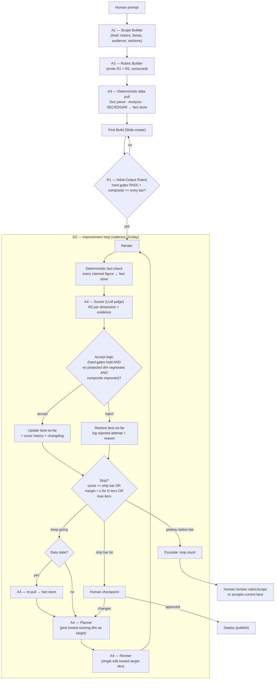

# Equity-research deck generator — agentic build plan

A defined plan for an autonomous deck generator that produces an
equity-research / investor deck from a prompt, then improves it on a
twice-daily loop without drifting from **truth**, **story**, or **visual
clarity**.

This document covers: (1) the state machine, (2) how the two rubrics are
**built and calibrated**, (3) the **Initial-Output Rubric (R1)**, (4) the
**Loop Improvement Rubric (R2)**, (5) the accept/reject math that guarantees
monotonic improvement with no truth regression, (6) agent contracts, and
(7) the persisted state schemas.

---

## 1. State machine



Two rubrics do two different jobs:

- **R1 (Initial-Output Rubric)** is an *acceptance gate*. It answers: "is the
  first draft good enough to be worth iterating on?" It runs **once**, between
  the first build and loop entry. Absolute thresholds, no history.
- **R2 (Loop Improvement Rubric)** is a *delta/monotonicity rubric*. It answers
  every iteration: "is this revision strictly better, and did it break any
  invariant?" It compares against best-so-far, not an absolute bar.

---

## 2. How the rubrics are built (Rubric Builder, A2)

A rubric is only useful if its dimensions are **observable, anchored, and
calibrated**. The Rubric Builder produces both rubrics through the same
five-step method, then versions them so changes are auditable.

1. **Derive dimensions** from two sources:
   - the **brief (A1)** — audience, thesis, required sections → scope/coverage
     dimensions;
   - **domain invariants** — for finance, every number is sourced; no
     forward-looking claim without a basis. These become *hard gates*, not
     graded dimensions.
2. **Anchor each dimension** with concrete descriptors at each scale point
   (see R1/R2 tables). "Actionability = 5" must read as an observable test a
   judge can apply the same way twice, e.g. *"every section ends with a
   decision-relevant takeaway tied to the thesis."* Vague anchors are the #1
   cause of judge noise.
3. **Assign weights** reflecting the brief's priorities. Weights live in the
   rubric file, not in the judge prompt, so they can be tuned without touching
   agent code.
4. **Calibrate against gold examples.** Hand-score 3–5 reference decks
   (a strong one, a weak one, and 2–3 in between). Run the LLM judge on them
   and adjust anchors until judge scores land within ±1 point of human scores.
   This is the step that turns "LLM-as-judge" from a guess into a measurement.
5. **Validate & version.** Hold out one gold deck; require judge↔human
   agreement on it before the rubric is allowed to drive the loop. Stamp the
   rubric with a semantic version; the changelog (§7) records every rubric
   change so a score jump can be attributed to a rubric edit vs. a real deck
   improvement.

> Calibration is not optional. Without it, R2's "improvement" is just judge
> variance and the loop will happily climb noise.

---

## 3. R1 — Initial-Output Rubric (acceptance gate)

Purpose: keep junk first-drafts out of the loop. Two parts.

**3a. Hard gates (binary — all must PASS to enter the loop):**

| Gate | Pass condition |
|---|---|
| Source-of-truth | 100% of figures/claims in the draft resolve to a fact-store entry with a citation. Zero unsourced numbers. |
| Scope coverage | Every required section from the brief (A1) is present and non-empty. |
| Structural validity | Deck renders; no broken slides, no placeholder text, no TODOs. |

Any gate fail → not "low score," but **reject and rebuild**. The loop never
starts on a draft with an unsourced number.

**3b. Graded baseline (0–5 anchored; weighted composite must clear the entry bar):**

| Dimension | Weight | 0 | 3 | 5 |
|---|---|---|---|---|
| Thesis clarity | 0.30 | no discernible thesis | thesis stated, loosely supported | thesis stated up front, every section ladders to it |
| Coverage depth | 0.25 | headings only | key drivers present | drivers + risks + catalysts quantified |
| Narrative flow | 0.20 | slides unordered | logical order | story builds; each slide earns the next |
| Visual baseline | 0.15 | walls of text | readable | one idea per slide, charts where numbers belong |
| Actionability | 0.10 | descriptive only | some takeaways | clear, decision-relevant recommendation |

Entry bar: **composite ≥ 3.2 / 5** AND all hard gates PASS. Below that, the
first build is cheaper to redo than to iterate.

---

## 4. R2 — Loop Improvement Rubric (monotonic, per-iteration)

This is the rubric the user asked for: it guarantees we **increase** on the
things that matter while **never derivating from truth, the story, or the
visuals.** It splits dimensions into *protected invariants* and *improvement
targets.*

**4a. Protected invariants (must hold every iteration; regression = auto-reject):**

| Invariant | Measured by | Rule |
|---|---|---|
| **Truth / source-of-truth** | deterministic fact-check (not the LLM judge) | Every figure traces to the fact store with a matching value. Any mismatch → reject revision, roll back. Score floored to 0 on this dim. |
| **Scope adherence** | judge vs. brief (A1) | Required sections still present and on-brief. Drop in coverage below R1 level → reject. |
| **Story integrity** | judge, narrative-coherence check | The through-line from R1 must not break. A revision that improves one slide but severs the thesis chain is rejected. |
| **Visual integrity** | judge + render lint | No new walls of text, no overflow, no chart removed that carried a number. Visual score may not drop below its accepted best. |

These are *floors*, not climb targets. They can stay flat; they may never go
down. This is what enforces "do not derive from truth, story, or visuals."

**4b. Improvement targets (0–5 anchored; the loop hill-climbs the weighted composite):**

| Dimension | Weight | What "5" looks like (anchor) |
|---|---|---|
| **Actionability** | 0.30 | Every section ends in a decision-relevant takeaway tied to the thesis; reader knows what to *do*, not just what *is*. |
| **Visual digestibility** | 0.25 | Each slide graspable in <10s: one idea, the right chart type, hierarchy guides the eye, minimal text. |
| **Clean & concise story** | 0.25 | Tight through-line, no redundant slides, each builds on the last; could be read aloud as a coherent argument. |
| **Metric traceability quality** | 0.20 | Beyond merely *passing* the truth gate: every metric is *labeled* with its source, period, and units inline, so the reader can self-verify. |

> Note the split on numbers: the **truth invariant (4a)** is a binary
> deterministic gate — "does this number exist in the fact store?" The
> **traceability dimension (4b)** is a graded quality target — "is the number
> *presented* so a reader can trace it?" The first prevents fabrication; the
> second is a thing we actively get better at.

**Composite:** `R2 = 0.30·Action + 0.25·Visual + 0.25·Story + 0.20·Trace`,
on the [0,5] scale, computed **only when all 4a invariants hold.**

---

## 5. Accept / reject math (the monotonicity guarantee)

Let `b` = best-so-far snapshot, `c` = candidate revision. Per-dimension scores
from R2's improvement targets are `s_d`; invariant flags from 4a are booleans.

**Accept `c` iff ALL of:**

1. **Invariants hold:** every 4a check on `c` PASSes (truth, scope, story,
   visual integrity). One fail → reject.
2. **No protected regression:** for each invariant dimension that carries a
   score (story, visual), `s_d(c) ≥ s_d(b) − τ`, with tolerance `τ = 0`
   for truth/scope and a small `τ = 0.1` for story/visual to allow lossless
   restructuring.
3. **Strict improvement:** `R2(c) ≥ R2(b) + δ` where `δ` is the minimum
   meaningful margin (e.g. `δ = 0.15`), so we don't accept judge noise.

Otherwise **roll back to `b`** and log the rejected attempt + reason. This is
hill-climbing with rollback: the composite is monotonically non-decreasing
across accepted iterations, and the invariants are monotonically protected.

**Stop conditions (any one):**

- **Ship:** `R2(b) ≥ ship_bar` (e.g. 4.3) AND all invariants PASS → human gate.
- **Plateau:** no accepted revision for `N` consecutive iterations
  (margin < δ) → escalate as stalled.
- **Budget:** `max_iters` reached → ship best-so-far to human gate.

Because every accepted step strictly increases the composite while holding the
floors, "the loop improves actionability / visual / story / traceability and
never sacrifices truth or coherence" is now a property the math enforces, not
a hope.

---

## 6. Agent contracts (I/O)

| Agent | Input | Output | Notes |
|---|---|---|---|
| **A1 Scope Builder** | human prompt | `brief{tickers, thesis, audience, required_sections[], tone}` | Brief is frozen; drift is measured against it. |
| **A2 Rubric Builder** | brief | `R1`, `R2` (versioned JSON, weights + anchors) | Runs calibration (§2) before emitting. |
| **A3 Data layer** | tickers, sections | `fact_store{id, metric, value, unit, period, source_url, retrieved_at}` | Deterministic. EDGAR/analysis only; LLM never writes here. |
| **A4 Slide-create** | brief, fact_store | `deck{slides[]}` with every figure tagged by `fact_id` | Tagging is what makes the fact-check deterministic. |
| **A4 Scorer** | deck, R2, fact_store | per-dim scores + evidence + invariant flags | Judge; structured output; cites which slide/fact drove each score. |
| **A4 Planner** | last R2 result | `target_dim` = lowest-scoring improvement dimension | One target per iteration → attributable deltas. |
| **A4 Reviser** | deck, target_dim, fact_store | revised deck (figures still `fact_id`-tagged) | One focused edit; may not introduce untagged numbers. |
| **Fact-check** | deck, fact_store | pass/fail per figure | Deterministic value match, not the judge. |

Key design rule: **the LLM judge never gates factual accuracy alone.** Slides
carry `fact_id` tags; the deterministic fact-checker confirms each tagged value
equals the fact store. The judge only scores *quality* dimensions.

---

## 7. Persisted state (loop memory)

```jsonc
// best_so_far.json — the current champion
{ "deck": { /* slides with fact_id tags */ },
  "r2": { "action": 4.1, "visual": 3.8, "story": 4.0, "trace": 3.9,
          "composite": 3.98, "invariants": {"truth": true, "scope": true,
          "story_integrity": true, "visual_integrity": true} },
  "rubric_version": "r2-1.2.0", "iter": 7 }

// score_history.jsonl — one line per iteration (accepted or rejected)
{ "iter": 8, "ts": "...", "accepted": false, "reason": "trace 3.9→3.7 regression",
  "candidate_r2": {...}, "target_dim": "trace" }

// changelog.jsonl — what each accepted revision changed and why
{ "iter": 7, "target_dim": "visual", "change": "split text slide 4 into chart + callout",
  "composite": "3.83→3.98", "rubric_version": "r2-1.2.0" }
```

Score history lets us tell improvement from noise and roll back; the changelog
explains *why* the deck looks the way it does after dozens of twice-daily runs;
stamping `rubric_version` on every row means a score jump caused by a rubric
edit is never mistaken for a real deck improvement.

---

## 8. Open decisions to confirm before building

- **Thresholds:** entry bar (3.2), ship bar (4.3), margin δ (0.15), plateau N,
  max_iters — these are starting guesses; calibrate on the first few real runs.
- **Weights:** R2 weights (0.30/0.25/0.25/0.20) reflect "actionability first";
  adjust to the audience.
- **Refresh policy:** does every loop re-pull EDGAR, or only on a price/filing
  change signal? Affects cost and how often numbers move under the prose.
- **Judge model & determinism:** fix temperature low and pin the model so
  score history is comparable across iterations.
